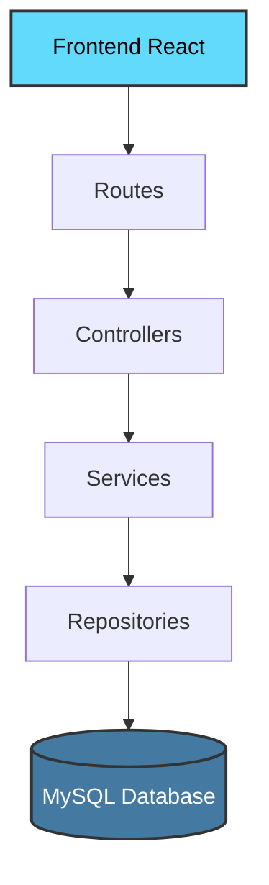

<div align="center">

# 🎓 SGPI 2.0

### Sistema de Gestão de Projetos Integradores — Versão GED

[](https://github.com)
[](https://nodejs.org)
[](https://reactjs.org)
[](https://mysql.com)

*Solução institucional de Gestão Eletrônica de Documentos para preservação e organização de entregas acadêmicas*

---

</div>

## 📖 Sobre o Projeto

O **SGPI 2.0** é um Sistema de Gestão Eletrônica de Documentos (GED) desenvolvido para centralizar, organizar e preservar entregas acadêmicas do curso de **Desenvolvimento de Software Multiplataforma (DSM)** da **Fatec Zona Leste**.

### 🎯 Problema Resolvido

A solução foi projetada para resolver desafios institucionais reais:

- 📁 **Desorganização** de arquivos acadêmicos dispersos
- ⚠️ **Risco de perda** de documentos importantes
- 🔄 **Ausência de padronização** estrutural
- ⚖️ **Necessidade de conformidade** com retenção legal de entregas

> Esta versão representa um **MVP funcional e implantável**, com arquitetura preparada para evolução controlada.

---

## ✨ Funcionalidades Principais

<table>
<tr>
<td width="50%">

### 👨‍🏫 Professor
- ✅ Criar pacotes de entrega por disciplina
- 📤 Enviar até 10 arquivos por operação
- 📊 Acompanhar status de processamento
- 🗂️ Gerenciar entregas próprias

</td>
<td width="50%">

### 👨‍💼 Coordenador
- 👁️ Visualizar todas as pastas do sistema
- 📈 Monitorar métricas globais
- 📥 Baixar pacotes consolidados
- 👥 Gerenciar usuários e acessos
- 🗑️ Excluir pastas conforme política institucional

</td>
</tr>
</table>

---

## 🏗️ Arquitetura

O sistema adota uma **Arquitetura em Camadas** seguindo princípios SOLID e separação de responsabilidades:



### 🔧 Componentes Estratégicos

| Componente | Tecnologia | Propósito |
|------------|-----------|-----------|
| **Autenticação** | JWT | Stateless e segura |
| **Autorização** | Middleware RBAC | Controle de acesso por papel |
| **Processamento** | Worker Interno | Operações assíncronas |
| **Armazenamento** | Google Drive API | Persistência escalável |
| **Compactação** | Archiver (streaming) | ZIP sem persistência local |

> 💡 A arquitetura foi pensada para permitir evolução futura para microsserviços, filas externas e escalabilidade horizontal.

---

## 🔐 Segurança e Governança

### Camadas de Proteção

```
┌─────────────────────────────────────┐
│   🔒 Autenticação JWT               │
├─────────────────────────────────────┤
│   ✉️  Verificação obrigatória email │
├─────────────────────────────────────┤
│   🔑 Hash Bcrypt (senhas)           │
├─────────────────────────────────────┤
│   👮 RBAC - Controle por papel      │
├─────────────────────────────────────┤
│   🛡️  Sanitização de arquivos       │
└─────────────────────────────────────┘
```

### ⚖️ Política de Retenção Documental

O sistema implementa regras institucionais rigorosas:

| Cenário | Tempo | Ação Permitida |
|---------|-------|----------------|
| 📂 Pastas com arquivos | < 5 anos | ❌ **Bloqueio de exclusão** |
| 📂 Pastas vazias | Qualquer | ✅ Remoção permitida |
| 📂 Pastas com arquivos | ≥ 5 anos | ✅ Exclusão permitida |

> ⏳ Esta política impede perda acidental de documentos acadêmicos, respeitando o tempo máximo de conclusão do curso.

---

## 📂 Estrutura de Organização

O sistema impõe organização automática e padronizada:

```
📚 Semestre (ex: 2024-1)
   └── 📖 Disciplina (ex: Estrutura de Dados)
          └── 📦 Pacote de Entrega (ex: Projeto Final - Árvores Binárias)
                 └── 📄 Arquivos enviados
```

**Benefício:** Eliminação total de dependência de organização manual por usuários.

---

## 💻 Stack Tecnológica

<div align="center">

### Backend


### Frontend


### Armazenamento


</div>

---

## 🚀 Instalação e Execução

### Pré-requisitos

- Node.js 18+
- MySQL 8.0+
- Conta Google Cloud (para Drive API)

### 1️⃣ Clonar o Repositório

```bash
git clone <url-do-repositorio>
cd sgpi2.0
```

### 2️⃣ Instalar Dependências

```bash
# Backend
cd backend
npm install

# Frontend
cd ../frontend
npm install
```

### 3️⃣ Configurar Variáveis de Ambiente

Crie um arquivo `.env` no diretório `backend`:

```env
# Servidor
PORT=3000

# Banco de Dados
DB_HOST=localhost
DB_USER=root
DB_PASSWORD=sua_senha
DB_NAME=sgpi

# Autenticação
JWT_SECRET=sua_chave_secreta_super_segura

# Google Drive API
GOOGLE_CLIENT_ID=seu_client_id
GOOGLE_CLIENT_SECRET=seu_client_secret
GOOGLE_REFRESH_TOKEN=seu_refresh_token
```

### 4️⃣ Executar a Aplicação

```bash
# Backend (terminal 1)
cd backend
npm run dev

# Frontend (terminal 2)
cd frontend
npm start
```

🌐 Acesse: `http://localhost:3000`

---

## ⚙️ Processamento Assíncrono

O sistema utiliza o padrão **Producer–Consumer** interno para uploads:

```
┌──────────────┐     ┌──────────────┐     ┌──────────────┐
│   Upload     │────▶│  Fila PENDING│────▶│    Worker    │
│   Iniciado   │     │   (MySQL)    │     │  Processor   │
└──────────────┘     └──────────────┘     └──────┬───────┘
                                                  │
                                                  ▼
                                          ┌──────────────┐
                                          │ Google Drive │
                                          └──────┬───────┘
                                                  │
                                                  ▼
                                          ┌──────────────┐
                                          │  COMPLETED   │
                                          └──────────────┘
```

### ✅ Benefícios

- 🚀 **Interface não bloqueante** - resposta imediata ao usuário
- 🔄 **Retentativa automática** em caso de falha
- 💪 **Maior confiabilidade** no processamento
- 🔌 **Recuperação após reinício** do servidor

---

## 📊 Dashboard e Métricas

<div align="left">

| Métrica | Descrição |
|---------|-----------|
| 📦 **Total de Pacotes** | Entregas registradas no sistema |
| 📁 **Arquivos Processados** | Status: Pendente, Completo, Erro |
| 💾 **Uso de Armazenamento** | Espaço ocupado no Google Drive |
| 👥 **Usuários Ativos** | Professores e coordenadores cadastrados |

</div>

---

## 🔮 Roadmap - Evolução Futura

O sistema foi arquitetado para permitir as seguintes extensões:

- [ ] 📝 **Logs estruturados** e auditoria completa
- [ ] 🔄 **Worker dedicado** (serviço separado)
- [ ] 📊 **Dashboards analíticos** avançados
- [ ] 🔔 **Sistema de notificações** (email/push)
- [ ] 🔍 **Busca full-text** de documentos
- [ ] 📱 **Aplicativo mobile** nativo
- [ ] 🤖 **Integração com IA** para classificação automática
- [ ] 🔐 **SSO** (Single Sign-On) institucional

> 💡 A base atual permite essas evoluções **sem refatoração estrutural crítica**.

---

## 📝 Status do Projeto

```
✅ MVP funcional e testado
✅ Arquitetura escalável implementada  
✅ Documentação técnica completa
✅ Pronto para ambiente de produção institucional
✅ Políticas de governança implementadas
```

---

## 👨‍💻 Autor

<div align="center">

### Kaique Santos

**Desenvolvimento de Software Multiplataforma (DSM)**  
Fatec Zona Leste

[](https://github.com/kaique12santos)
[](https://www.linkedin.com/in/kaique-caitano-b68b902ba/)

</div>

---

<div align="center">

### 📄 Licença

Este projeto foi desenvolvido como Projeto Integrador acadêmico.

**© 2024 - Fatec Zona Leste**

---

⭐ *Se este projeto foi útil, considere dar uma estrela!*

</div>