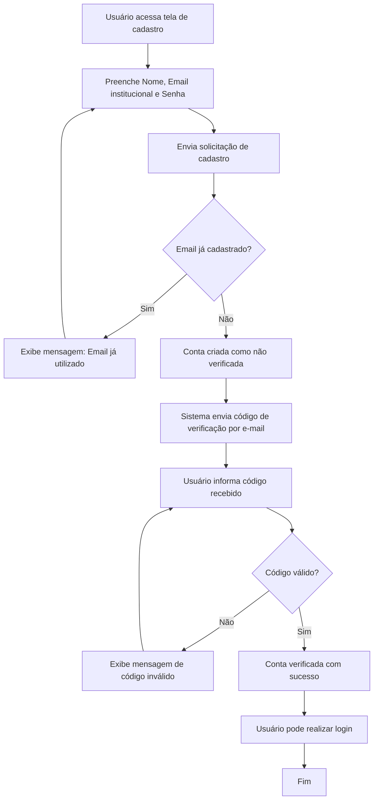

```mermaid
flowchart TD

A[Usuário acessa tela de cadastro] --> B[Preenche Nome, Email institucional e Senha]
B --> C[Envia solicitação de cadastro]

C --> D{Email já cadastrado?}

D -- Sim --> E[Exibe mensagem: Email já utilizado]
E --> B

D -- Não --> F[Conta criada como não verificada]
F --> G[Sistema envia código de verificação por e-mail]
G --> H[Usuário informa código recebido]
H --> I{Código válido?}

I -- Não --> J[Exibe mensagem de código inválido]
J --> H

I -- Sim --> K[Conta verificada com sucesso]
K --> L[Usuário pode realizar login]

L --> M[Fim]
```