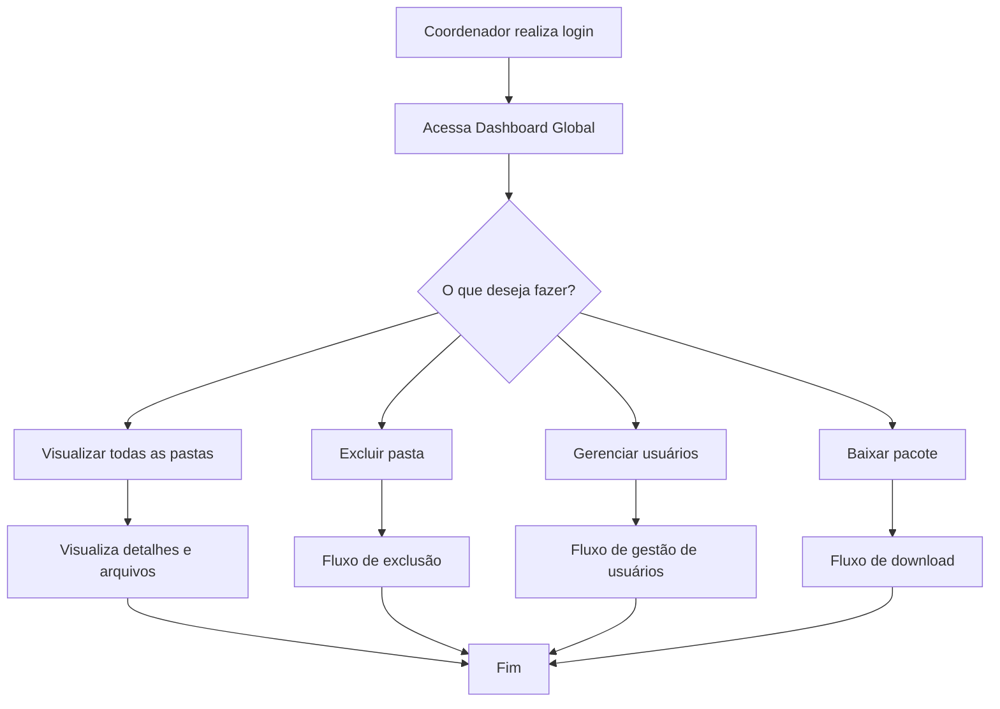

```mermaid
flowchart TD

A[Coordenador realiza login] --> B[Acessa Dashboard Global]
B --> C{O que deseja fazer?}

C --> D[Visualizar todas as pastas]
C --> E[Excluir pasta]
C --> F[Gerenciar usuários]
C --> G[Baixar pacote]

D --> H[Visualiza detalhes e arquivos]
E --> I[Fluxo de exclusão]
F --> J[Fluxo de gestão de usuários]
G --> K[Fluxo de download]

H --> L[Fim]
I --> L
J --> L
K --> L
```