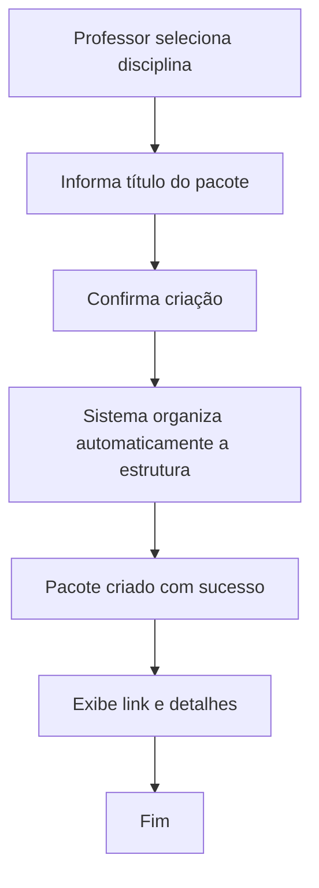

```mermaid
flowchart TD

A[Professor seleciona disciplina] --> B[Informa título do pacote]
B --> C[Confirma criação]

C --> D[Sistema organiza automaticamente a estrutura]
D --> E[Pacote criado com sucesso]
E --> F[Exibe link e detalhes]
F --> G[Fim]
```