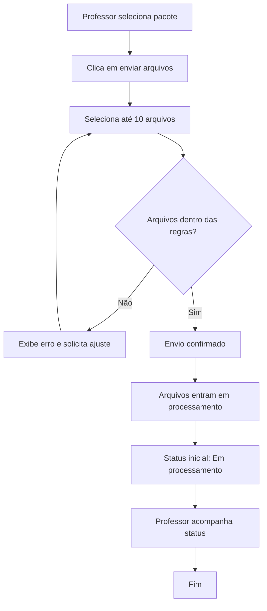

```mermaid
flowchart TD

A[Professor seleciona pacote] --> B[Clica em enviar arquivos]
B --> C[Seleciona até 10 arquivos]
C --> D{Arquivos dentro das regras?}

D -- Não --> E[Exibe erro e solicita ajuste]
E --> C

D -- Sim --> F[Envio confirmado]
F --> G[Arquivos entram em processamento]
G --> H[Status inicial: Em processamento]
H --> I[Professor acompanha status]
I --> J[Fim]
```