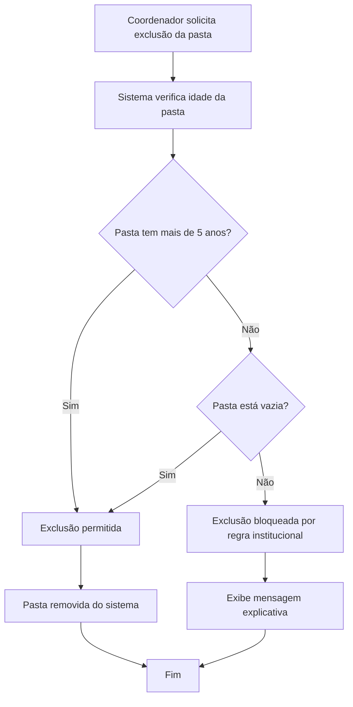

```mermaid
flowchart TD

A[Coordenador solicita exclusão da pasta] --> B[Sistema verifica idade da pasta]

B --> C{Pasta tem mais de 5 anos?}

C -- Sim --> D[Exclusão permitida]

C -- Não --> E{Pasta está vazia?}

E -- Sim --> D
E -- Não --> F[Exclusão bloqueada por regra institucional]

D --> G[Pasta removida do sistema]
F --> H[Exibe mensagem explicativa]

G --> I[Fim]
H --> I
```