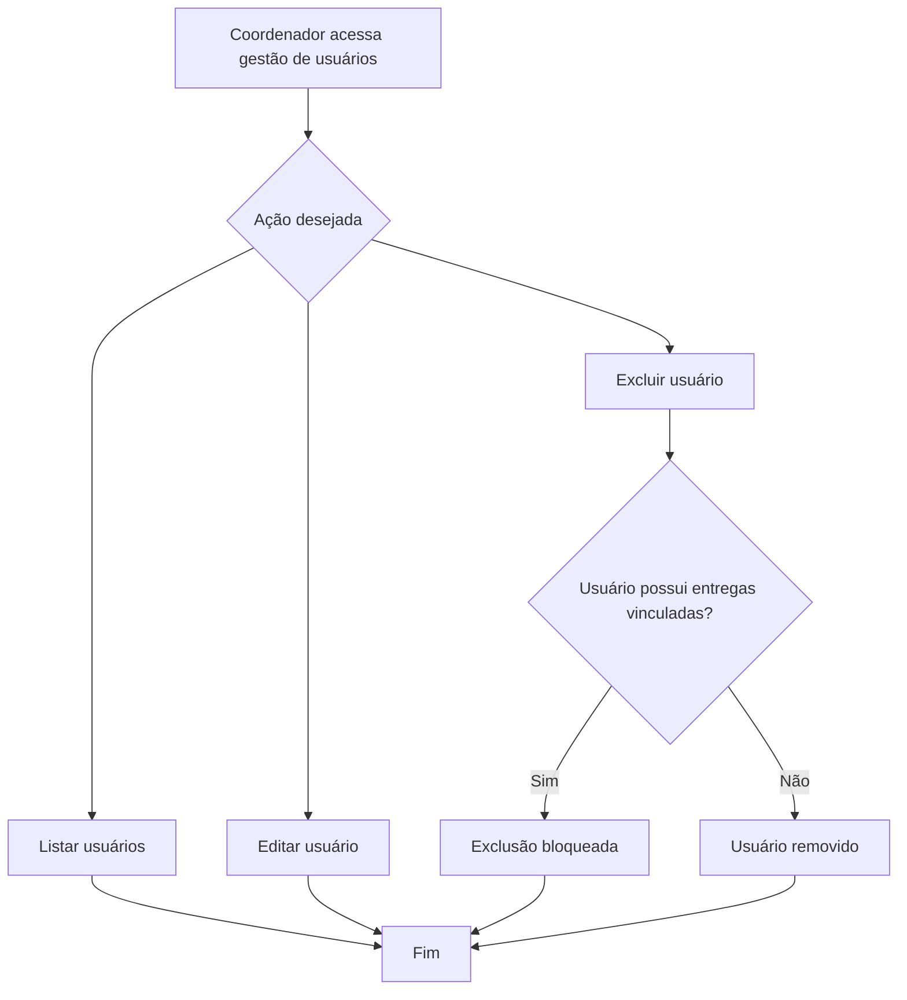

```mermaid
flowchart TD

A[Coordenador acessa gestão de usuários] --> B{Ação desejada}

B --> C[Listar usuários]
B --> D[Editar usuário]
B --> E[Excluir usuário]

E --> F{Usuário possui entregas vinculadas?}

F -- Sim --> G[Exclusão bloqueada]
F -- Não --> H[Usuário removido]

C --> I[Fim]
D --> I
G --> I
H --> I
```