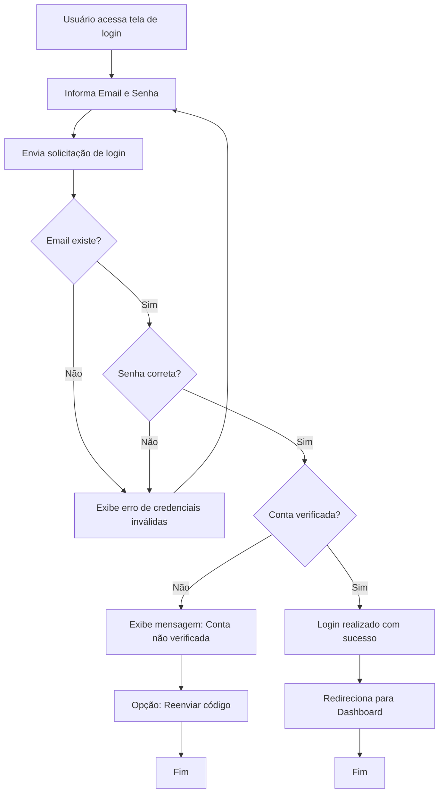

```mermaid
flowchart TD

A[Usuário acessa tela de login] --> B[Informa Email e Senha]
B --> C[Envia solicitação de login]

C --> D{Email existe?}

D -- Não --> E[Exibe erro de credenciais inválidas]
E --> B

D -- Sim --> F{Senha correta?}

F -- Não --> E

F -- Sim --> G{Conta verificada?}

G -- Não --> H[Exibe mensagem: Conta não verificada]
H --> I[Opção: Reenviar código]
I --> J[Fim]

G -- Sim --> K[Login realizado com sucesso]
K --> L[Redireciona para Dashboard]

L --> M[Fim]

```