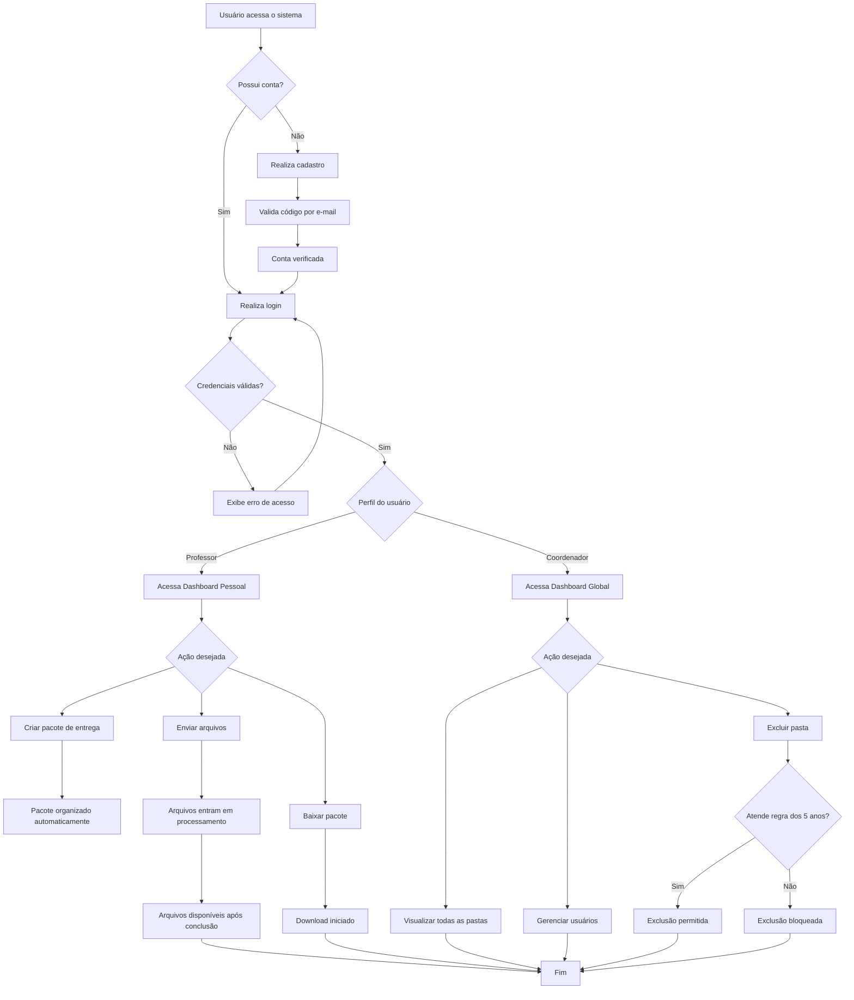

```mermaid
flowchart TD

%% Entrada
A[Usuário acessa o sistema] --> B{Possui conta?}

B -- Não --> C[Realiza cadastro]
C --> D[Valida código por e-mail]
D --> E[Conta verificada]

B -- Sim --> F[Realiza login]
E --> F

%% Login
F --> G{Credenciais válidas?}

G -- Não --> H[Exibe erro de acesso]
H --> F

G -- Sim --> I{Perfil do usuário}

%% Professor
I -- Professor --> J[Acessa Dashboard Pessoal]
J --> K{Ação desejada}

K --> L[Criar pacote de entrega]
L --> M[Pacote organizado automaticamente]

K --> N[Enviar arquivos]
N --> O[Arquivos entram em processamento]
O --> P[Arquivos disponíveis após conclusão]

K --> Q[Baixar pacote]
Q --> R[Download iniciado]

%% Coordenador
I -- Coordenador --> S[Acessa Dashboard Global]
S --> T{Ação desejada}

T --> U[Visualizar todas as pastas]
T --> V[Gerenciar usuários]

T --> W[Excluir pasta]
W --> X{Atende regra dos 5 anos?}

X -- Sim --> Y[Exclusão permitida]
X -- Não --> Z[Exclusão bloqueada]

%% Encerramento
P --> AA[Fim]
R --> AA
U --> AA
V --> AA
Y --> AA
Z --> AA
```