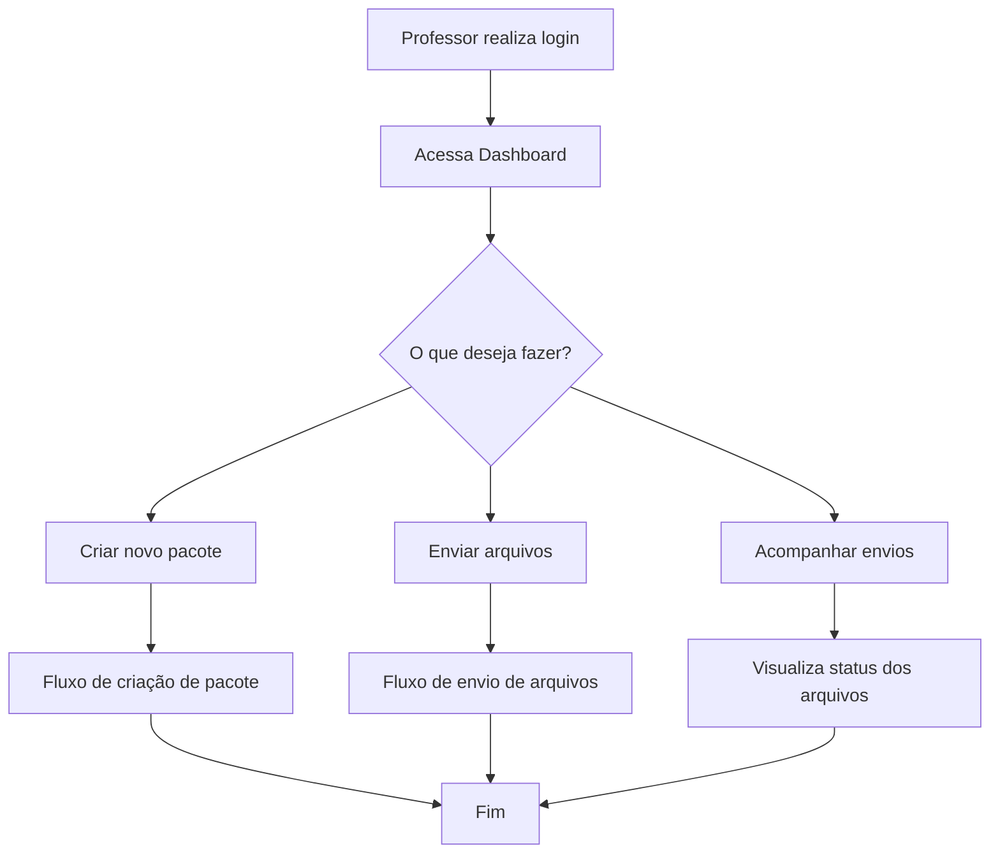

```mermaid
flowchart TD

A[Professor realiza login] --> B[Acessa Dashboard]
B --> C{O que deseja fazer?}

C --> D[Criar novo pacote]
C --> E[Enviar arquivos]
C --> F[Acompanhar envios]

D --> H[Fluxo de criação de pacote]
E --> I[Fluxo de envio de arquivos]
F --> J[Visualiza status dos arquivos]

H --> L[Fim]
I --> L
J --> L
```